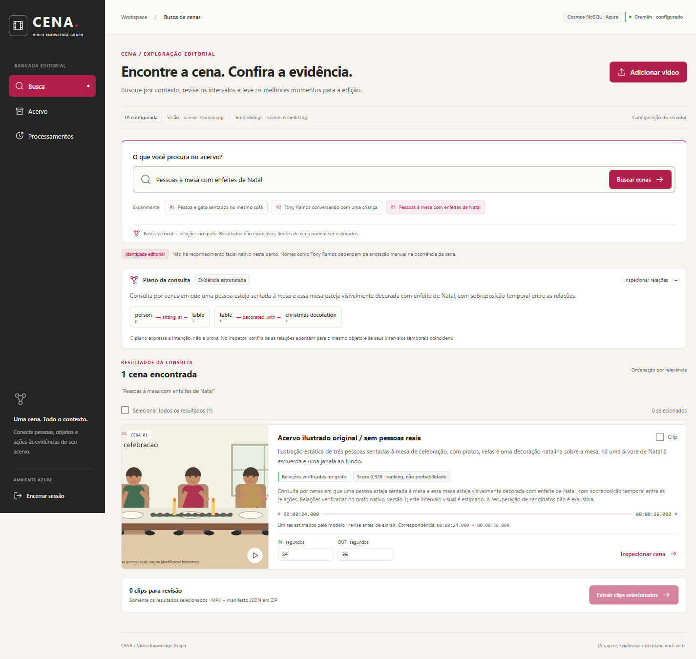
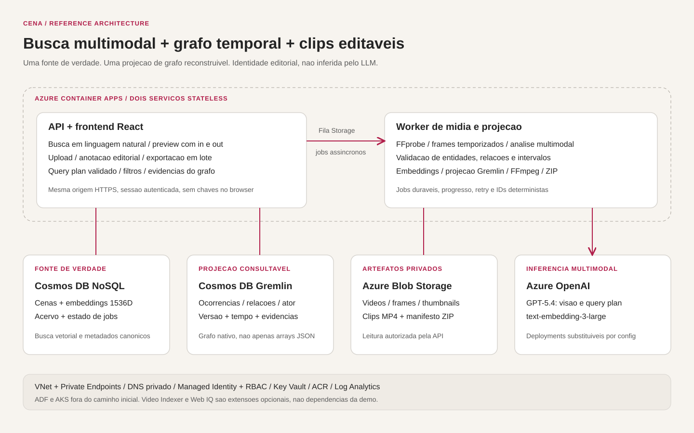
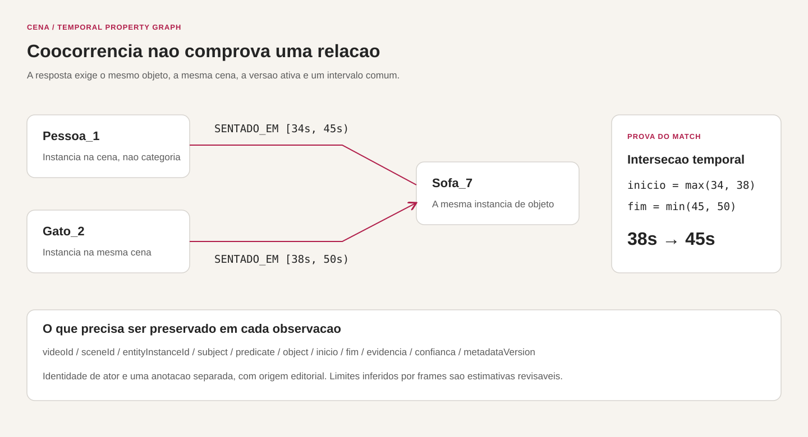
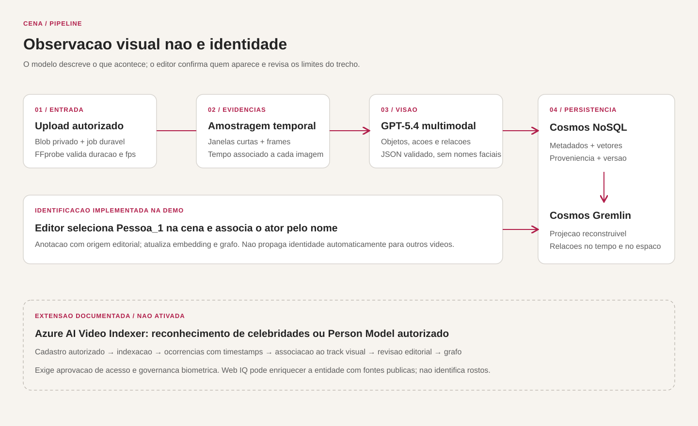

# CENA — busca de cenas com knowledge graph temporal

Aplicação de referência para indexar vídeos, pesquisar situações em linguagem natural e extrair os intervalos encontrados. Combina análise multimodal no Azure OpenAI, busca vetorial no Cosmos DB for NoSQL e uma projeção nativa de grafo no Cosmos DB for Apache Gremlin.

A identidade dos atores nesta demo é **editorial**: uma pessoa confirma o nome associado a uma ocorrência visual. O modelo de visão não identifica pessoas pelo rosto. O pipeline opcional com Azure AI Video Indexer está descrito adiante, mas não é executado pela aplicação.



*Interface usando vídeo ilustrado original, sem pessoas reais. O resultado exibe a janela estimada, as relações verificadas e os controles de extração.*



## O problema de recuperação

As consultas abaixo não são equivalentes a procurar palavras no catálogo:

- “Pessoa e gato sentados no sofá”: exige duas relações com a mesma instância de sofá e um intervalo comum.
- “Tony Ramos conversando com uma criança”: exige identidade confirmada, uma relação entre ocorrências e compatibilidade temporal.
- “Pessoas sentadas numa mesa com enfeites de Natal”: exige ligar as pessoas à mesa e a decoração àquela mesa, não a objetos que aparecem em outro momento.

Um embedding encontra candidatos semanticamente próximos. O grafo permite verificar as relações. Nenhum dos dois corrige uma observação visual errada: o resultado mostra evidências e permite revisão do trecho antes da extração.

## Componentes

| Componente | Responsabilidade |
|---|---|
| React + TypeScript | Busca, acervo, upload, preview, inspeção de relações, anotação editorial e exportação. |
| API no Container Apps | Serve a UI na mesma origem; autentica, valida consultas, recupera cenas, acessa o grafo e cria jobs. |
| Worker no Container Apps | Executa análise de mídia, enriquecimento por IA, projeção do grafo e extração FFmpeg fora das requisições interativas. |
| Cosmos DB NoSQL | Fonte de verdade para vídeos, cenas, metadados versionados, embeddings e estado de jobs. |
| Cosmos DB Gremlin | Projeção nativa de ocorrências e relações temporais, reconstruível a partir dos metadados canônicos. |
| Blob Storage | Vídeos originais, imagens de evidência e pacotes de saída; containers privados. |
| Storage Queue | Entrega assíncrona de trabalho; o progresso e resultado ficam no estado persistido do job. |
| Azure OpenAI | Modelo multimodal para observações e interpretação de consultas; modelo de embeddings para recuperação semântica. |
| ACR, Key Vault, Managed Identity, Log Analytics | Imagens, segredos necessários, acesso a serviços e logs de execução. |

O ambiente Container Apps integra uma VNet própria. Key Vault, Blob/Queue e ambos os Cosmos DB usam Private Endpoints e DNS privado, com acesso público desabilitado. Somente a aplicação autenticada tem ingress público. ACR e a conta Azure OpenAI reutilizada conservam sua configuração de rede; o acesso de dados à IA usa Entra ID.

### Por que Container Apps, não AKS?

O problema precisa de uma API e de processamento assíncrono de mídia, não de controle sobre um cluster Kubernetes. Container Apps mantém implantação e escala separadas, sem administrar nós, ingress controllers ou atualizações do cluster. O worker usa CPU e FFmpeg; inferência é consumida como serviço.

AKS passa a fazer sentido com inferência em GPUs próprias, operadores especializados, requisitos de scheduling ou uma plataforma Kubernetes já operada pela equipe. ADF não participa do caminho inicial: adicione-o para backfill de um MAM/DAM, cópia de acervos legados e orquestração de lotes, reutilizando a mesma ingestão.

## Modelo de grafo temporal



**Categoria, ocorrência e identidade são coisas distintas.** “Pessoa” é uma categoria. `Pessoa_1` é uma ocorrência em uma cena. O nome de um ator é uma identidade editorial associada àquela ocorrência. O mesmo vale para `Sofa_7`: duas relações com a categoria “sofá” não comprovam que as entidades estejam no mesmo móvel.

O modelo lógico é:

```text
Vídeo → Cena → Ocorrência
                  ├─ categoria / descrição visual
                  ├─ identidade editorial, quando confirmada
                  └─ Relação → outra Ocorrência
```

Cada relação preserva origem, evidência, confiança, versão e intervalo. Para uma pessoa no sofá em `[34,45)` e um gato no mesmo sofá em `[38,50)`, a resposta válida é `[38,45)`. Intervalos sem sobreposição, objetos distintos e versões antigas não satisfazem a consulta.

Exemplo simplificado de metadado canônico:

```json
{
  "id": "scene-002",
  "videoId": "video-042",
  "metadataVersion": "v1",
  "timecode": { "startSeconds": 34, "endSeconds": 50 },
  "boundarySource": "model-estimate",
  "entities": [
    { "id": "p1", "type": "person", "name": "pessoa", "confidence": 0.92 },
    { "id": "c1", "type": "animal", "name": "gato", "confidence": 0.96 },
    { "id": "s1", "type": "object", "name": "sofa", "confidence": 0.95 }
  ],
  "relations": [
    {
      "id": "r1", "subject": "p1", "predicate": "sentado_em", "object": "s1",
      "timecode": { "startSeconds": 34, "endSeconds": 45 },
      "confidence": 0.90, "evidence": "Frames temporizados da cena"
    },
    {
      "id": "r2", "subject": "c1", "predicate": "sentado_em", "object": "s1",
      "timecode": { "startSeconds": 38, "endSeconds": 50 },
      "confidence": 0.93, "evidence": "Frames temporizados da cena"
    }
  ]
}
```

### Duas APIs Cosmos DB, duas responsabilidades

NoSQL e Gremlin são contas distintas. O índice vetorial de NoSQL não é automaticamente um índice de Gremlin. O worker materializa a projeção do grafo usando identificadores e versões derivados da fonte de verdade.

Essa separação é um padrão **CQRS com projeção reconstruível**, não duas bases editadas independentemente. O status de projeção torna falhas visíveis. Uma anotação editorial exige atualizar o metadado, o embedding e a projeção antes de apresentar o novo estado como consultável.

O particionamento por vídeo favorece percursos locais. Consultas globais por ator e grafos com percursos profundos entre milhares de vídeos exigem outra avaliação de particionamento, índices e RU. Neo4j é uma alternativa relevante quando Cypher, algoritmos de grafos ou exploração multi-hop global são requisitos centrais; não é uma dependência desta implantação.

## Ingestão e geração de metadados



1. O usuário envia um arquivo local. A API grava o original em Blob privado e cria um job.
2. O worker inspeciona a mídia com FFprobe e produz frames temporizados em janelas curtas.
3. O modelo multimodal descreve a cena, objetos, ações e relações. A aplicação valida a estrutura, referências entre entidades e limites de tempo.
4. A descrição composta recebe um embedding; os metadados são persistidos em NoSQL e projetados em Gremlin.
5. O editor revisa evidências e pode associar o nome de um ator a uma ocorrência.

O perfil Azure desta demo utiliza **GPT-5.4** para análise multimodal/interpretação e **text-embedding-3-large**, reduzido a **1536 dimensões**, para recuperação. Os nomes dos deployments são configuráveis; não há chamadas de IA no browser. Trocar o modelo ou a dimensão exige avaliar compatibilidade e reindexar quando necessário.

**Amostragem não é análise de todos os frames.** Janelas curtas limitam custo, latência e tamanho de contexto, mas podem perder ações breves. “Conversando” inferido visualmente é uma observação sobre a imagem, não uma transcrição nem prova de diálogo audível. O pipeline não inventa falas.

O perfil da demo usa **janelas fixas de até 12 segundos, até seis frames a cada dois segundos, vídeos de até 180 segundos e arquivos de até 200 MB**. Não inclui detector automático de cortes nem tracking contínuo. Para indexação editorial de longa duração, substitua o segmentador por detecção de shots, preserve o mapeamento ao timebase original e refine os limites dos matches com amostragem densa antes da revisão humana.

### Busca e exportação

```text
Pergunta → plano estruturado validado → candidatos vetoriais
         → evidências no grafo → vínculos + interseção temporal
         → vídeo, início, fim e explicação → revisão → job de clips
```

Texto do usuário e saídas do modelo não são executados como código SQL ou Gremlin. As consultas usam templates e parâmetros, com limites explícitos.

Conjunções de várias entidades exigem evidência relacional temporal para cada variável. A presença de dois nomes em uma mesma janela, sem uma relação que sustente o intervalo, não é tratada como coocorrência comprovada. A ontologia inclui `sitting_on`, `sitting_at`, `decorated_with` e `talking_to`; este último representa conversa aparente visualmente, não confirmação por áudio.

Uma busca por uma única entidade retorna a janela que contém sua observação; não determina o intervalo exato de presença daquela entidade. Esse limite fica explícito para não confundir janelas de análise com tracking contínuo. Antes de exigir precisão frame a frame, adicione tracks e intervalos por ocorrência, refine os limites com amostragem densa e avalie contra anotações humanas.

O resultado de busca semântica é um conjunto limitado de candidatos, **não uma prova de cobertura completa do acervo**. “Extrair selecionados” opera sobre os resultados retornados. Para requisitos de exaustividade, use consultas estruturadas completas, paginação e avaliação de recall.

A extração reencoda os intervalos aprovados com FFmpeg e produz um pacote com clips MP4 e manifesto de edição. O manifesto preserva o vínculo ao original e os tempos solicitados. Reencodar evita depender de keyframes para o início do corte.

**Precisão de corte ≠ precisão de detecção.** O corte segue os tempos aprovados, respeitando a granularidade dos frames. Os tempos inferidos a partir de imagens amostradas continuam sendo estimativas e devem ser revisados para edição final.

## Identificação editorial dos atores

No inspetor de uma cena, selecione a ocorrência do tipo pessoa e associe o nome do ator. A anotação vale para aquela ocorrência; não há propagação facial automática para outros vídeos.

Isso permite consultar nomes confirmados sem atribuir ao LLM uma capacidade biométrica. Mantenha ator e personagem como conceitos separados: uma pessoa pode interpretar diferentes personagens, e o mesmo personagem pode ter diferentes intérpretes.

### Extensão possível: Azure AI Video Indexer

O [Azure AI Video Indexer](https://learn.microsoft.com/en-us/azure/azure-video-indexer/face-detection-insight) documenta reconhecimento de celebridades e [Person Models personalizados](https://learn.microsoft.com/en-us/azure/azure-video-indexer/customize-person-model-how-to). O pipeline de extensão seria:

1. Obter aprovação para as funcionalidades de reconhecimento facial e definir direitos de uso, consentimentos aplicáveis, retenção e exclusão.
2. Configurar o reconhecimento de celebridades ou cadastrar imagens autorizadas do elenco em um Person Model.
3. Indexar o vídeo e recuperar as ocorrências identificadas, timestamps e confiança.
4. Associar cada ocorrência ao track/instância visual da cena usando evidências espaciais e temporais. Sobreposição temporal sozinha não identifica qual das pessoas é o ator.
5. Encaminhar resultados ambíguos para revisão; persistir identidade confirmada, origem, confiança e evidência.
6. Regerar embeddings e projeção do grafo.

**Esse módulo não está ativado na demo.** Identificação facial, personalização e reconhecimento de celebridades são recursos de [acesso limitado](https://learn.microsoft.com/en-us/azure/azure-video-indexer/limited-access-features), sujeitos a aprovação da Microsoft; uma subscription non-production não recebe acesso automático. A documentação também informa restrições regionais, incluindo indisponibilidade de detecção facial em Brazil South. Não há garantia de cobertura de um ator específico na base de celebridades.

Azure AI Face é uma alternativa para matching contra cadastro autorizado, mas requer construir a extração de frames, tracking e consolidação temporal ao redor da API.

### Onde Web IQ poderia entrar

[Microsoft Web IQ](https://www.microsoft.com/en-us/WebIQ) fornece recuperação de informações públicas da web para agentes. Pode enriquecer uma identidade já confirmada com referências sobre filmografia, elenco e personagens, preservando URLs e data da consulta.

Não há capacidade pública documentada que o torne substituto de reconhecimento facial em vídeos privados. A demo não envia frames, rostos nem informações privadas do acervo ao Web IQ. Enriquecimento web e identificação visual são etapas diferentes; o acesso ao Web IQ também é limitado.

## Patterns replicáveis

| Pattern | Aplicação concreta |
|---|---|
| Fonte canônica + projeção de leitura | Metadados em NoSQL; grafo reconstruível e versionado em Gremlin. |
| Recuperação vetorial + verificação relacional | Similaridade recupera candidatos; relações e tempos sustentam o match. |
| Saída de IA como dado não confiável | Validação de esquema, IDs, intervalos e limites antes da persistência. |
| Identidade separada de percepção | Objetos e ações pelo modelo; nomes de pessoas confirmados editorialmente. |
| Processamento assíncrono idempotente | Busca não espera FFmpeg; jobs têm progresso, erro e resultado persistidos. |
| Evidência e proveniência | Cada observação preserva frames, modelo, versão e origem. |
| Portas de integração explícitas | Serviços de IA e banco ficam no backend; nenhum segredo chega ao frontend. |

O adaptador Gremlin trata throttling por operação, inclusive quando o serviço encapsula um 429 em uma resposta Gremlin 500. IDs determinísticos e propriedades de cardinalidade simples tornam a repetição idempotente, sem reiniciar toda a projeção. O worker mantém leases e heartbeats; `/healthz` reflete a saúde das rotinas de consumo e recuperação.

## Estrutura

```text
apps/api/         HTTP, autenticacao, busca, midia e jobs
apps/worker/      pipeline multimodal e extracao de clips
apps/frontend/    workspace editorial React
packages/shared/ contratos e componentes compartilhados do backend
infra/            Bicep
scripts/          implantacao
samples/          gerador de video ilustrado original
docs/images/      arquitetura, pipeline e modelo temporal
```

## Desenvolvimento local

Requisitos: Node.js 22+, npm, Azure CLI e recursos Azure configurados. A aplicação local usa os serviços reais; não substitui chamadas por respostas simuladas quando faltam credenciais.

```powershell
npm ci
Copy-Item .env.sample .env
# Preencha endpoints e nomes dos deployments; mantenha segredos fora do Git.
az login --tenant "<tenant-non-production>"
npm run build
npm run dev
# Em outro terminal, na raiz do repositorio:
npm run start:worker
```

Abra `http://localhost:5173`, o mesmo origin definido em `PUBLIC_ORIGIN` no `.env`. O frontend encaminha `/api` para a API local. Os scripts locais carregam o `.env`; o worker deve ser executado separadamente para processar uploads e exports. As identidades locais precisam das mesmas permissões de dados necessárias ao serviço. Em Azure, utilize Managed Identity e referências a segredos.

## Implantação rápida no Azure

Requisitos: PowerShell 7, Azure CLI com Bicep, subscription non-production, permissão para criar recursos e role assignments, quota dos modelos na região e capacidade de executar builds no ACR. Docker Desktop não é necessário: a imagem é compilada no Azure.

O script usa a subscription informada em cada comando, sem alterar a subscription padrão do CLI. Os parâmetros abaixo criam recursos dedicados, incluindo uma conta Azure OpenAI:

```powershell
az login --tenant "<tenant-non-production>"
npm ci
npm run build
$senha = Read-Host "Senha da demo (minimo 24 caracteres)" -AsSecureString

.\scripts\Deploy.ps1 `
  -SubscriptionId "<subscription-id>" `
  -ExpectedTenantId "<tenant-non-production>" `
  -ResourceGroupName "rg-cena-demo" `
  -Location "eastus2" `
  -DemoPassword $senha `
  -CreateOpenAiAccount `
  -OpenAiAccountName "<nome-globalmente-unico>" `
  -OpenAiChatModelName "gpt-5.4" `
  -OpenAiChatModelVersion "2026-03-05"
```

O script provisiona ACR/Key Vault/identidade, bancos/Storage/modelos, compila a imagem e publica API e worker. `-PrepareOnly` provisiona a infraestrutura sem construir nem publicar a aplicação. Os nomes e versões de modelo dependem da disponibilidade e quota da sua subscription.

Para reutilizar uma conta e deployments existentes, omita `-CreateOpenAiAccount` e informe:

```powershell
.\scripts\Deploy.ps1 `
  -SubscriptionId "<subscription-id>" `
  -ExpectedTenantId "<tenant-non-production>" `
  -ResourceGroupName "rg-cena-demo" `
  -Location "eastus2" `
  -ExistingOpenAiResourceId "<resource-id-da-conta>" `
  -ExistingOpenAiEndpoint "https://<conta>.openai.azure.com/" `
  -OpenAiChatDeploymentName "<deployment-multimodal>" `
  -OpenAiEmbeddingsDeploymentName "<deployment-text-embedding-3-large>"
```

A URL é exibida ao final. A senha da demo fica no segredo `app-password` do Key Vault. `-DemoPassword` permite escolher uma senha conhecida sem lê-la pelo endpoint privado; sem esse parâmetro, o primeiro deploy gera uma senha aleatória. Para ler o segredo, é necessário RBAC **e** conectividade à VNet, inclusive ao usar o portal. O script não imprime a senha nem a salva nos outputs. Reimplantações sem `-DemoPassword` preservam o segredo existente; fornecê-lo explicitamente atualiza o segredo. Outputs sem segredos ficam em `.local\deploy`, ignorado pelo Git.

Os containers `scenes` e `catalog` usam throughput dedicado; vetores não são suportados em uma conta com throughput compartilhado de banco. A configuração inicial totaliza **1.200 RU/s provisionados**: 400 em cada container NoSQL e 400 para o grafo Gremlin. Ajuste somente após medir o workload.

Private Endpoints, DNS privado e o ambiente de rede também têm custos. O modo local precisa de VPN, rede peered ou estação dentro da VNet para alcançar os serviços privados; a autenticação do CLI sozinha não fornece conectividade.

### Vídeo de demonstração sem mídia de terceiros

```powershell
python -m venv .local\media-venv
.\.local\media-venv\Scripts\python.exe -m pip install -r samples\requirements.txt
.\.local\media-venv\Scripts\python.exe samples\create_demo_video.py
```

O gerador cria `.local\sample\cena-acervo-ilustrado.mp4`: três situações ilustradas, sem pessoas reais nem áudio. Envie o arquivo pela UI para executar o pipeline de IA. O JSON de referência gerado serve para avaliação humana; não é usado para preencher os metadados ou respostas.

Para demonstrar identidade editorial nesse material, use um nome explicitamente fictício. Uma anotação como “Tony Ramos” em um desenho não demonstraria reconhecimento do ator.

## Segurança, custos e limites

- Recursos de mídia privados e operações protegidas pela API. Acesso ao frontend não deve implicar acesso anônimo ao acervo.
- Autenticação simplificada por senha de demo e cookie HttpOnly; não é uma implementação de identidade corporativa ou autorização multiusuário. Para produção, use Entra ID e autorização por acervo.
- Managed Identity para serviços compatíveis. A credencial necessária ao cliente Gremlin fica em Key Vault, nunca no repositório.
- O repositório deve conter somente código, infraestrutura, documentação e fontes dos exemplos. Não publique vídeos do acervo, chaves, cookies, metadados reais nem arquivos de ambiente.
- Cosmos provisionado e réplicas mínimas têm custo mesmo sem buscas. Inferência, tokens de imagem, armazenamento, operações, logs e exportações têm custos variáveis. Limites de duração, concorrência e tamanho são controles de demo, não estimativas de capacidade de produção.
- Um catálogo pequeno pode executar varredura vetorial: os índices `quantizedFlat` e `diskANN` exigem ao menos 1.000 vetores para a indexação quantizada descrita na documentação. Não use uma demo de poucas cenas como benchmark de escala.
- Para produção, avalie endpoints privados, autorização por usuário/acervo, retenção, exclusão de projeções, backups, métricas de recall, limites de consumo e revisão dos direitos de reutilização da mídia.

## Referências técnicas

- [Busca vetorial no Cosmos DB NoSQL](https://learn.microsoft.com/en-us/azure/cosmos-db/vector-search)
- [Cosmos DB Gremlin e compatibilidade](https://learn.microsoft.com/en-us/azure/cosmos-db/gremlin/support)
- [Particionamento de grafos](https://learn.microsoft.com/en-us/azure/cosmos-db/gremlin/partitioning)
- [Saídas estruturadas no Azure OpenAI](https://learn.microsoft.com/en-us/azure/foundry/openai/how-to/structured-outputs)
- [Video Indexer: funcionalidades de acesso limitado](https://learn.microsoft.com/en-us/azure/azure-video-indexer/limited-access-features)
